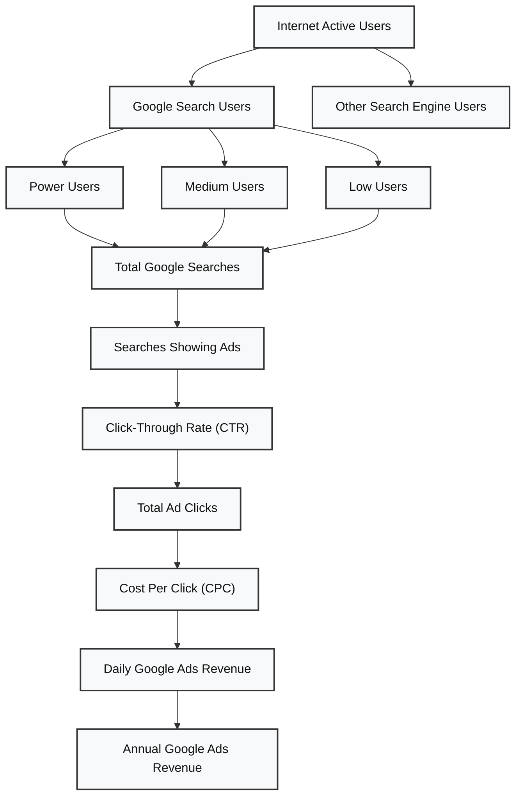

# Guesstimate 2: Estimate Google Ads Revenue Through Search in India Annually

## Clarifying Questions

Before solving the guesstimate, we clarify the scope of the question:

- Are we estimating Google Ads revenue for **India or globally**?
- Are we calculating the revenue **monthly or annually**?
- Are we considering advertising through **Google Search only**, or should we also include platforms such as **YouTube**?

### Final Clarified Question

Estimate the annual Google Ads revenue generated through Google Search in India.

---

## Framework

The estimation will follow the following framework:

## Framework

The estimation will follow this framework:

---

# Step 1: Estimate Internet Active Users

Assumption:

- Total active internet users in India = **600 million**

---

# Step 2: Estimate Google Search Users

We assume:

- **2/3** of active internet users use Google Search.
- **1/3** use other search engines such as Bing, Yahoo, etc.

### Google Search Users

= 600 million × 2/3

= **400 million users**

### Other Search Engine Users

= 600 million × 1/3

= **200 million users**

Therefore, we consider **400 million Google Search users** for the remaining calculation.

---

# Step 3: Segment Google Search Users

We divide Google Search users into three categories:

| User Segment | % of Google Search Users | Number of Users |
|---|---:|---:|
| Power Users | 20% | 80 million |
| Medium Users | 60% | 240 million |
| Low Users | 20% | 80 million |
| **Total** | **100%** | **400 million** |

### Power Users

= 400M × 20%

= **80M users**

### Medium Users

= 400M × 60%

= **240M users**

### Low Users

= 400M × 20%

= **80M users**

---

# Step 4: Estimate Searches Per User

Assume:

- Power users perform **10 searches/day**
- Medium users perform **2 searches/day**
- Low users perform **1 search/day**

| User Segment | Users | Searches/User/Day | Total Searches/Day |
|---|---:|---:|---:|
| Power Users | 80M | 10 | 800M |
| Medium Users | 240M | 2 | 480M |
| Low Users | 80M | 1 | 80M |
| **Total** | **400M** | | **1,360M** |

### Power Users

= 80M × 10

= **800M searches/day**

### Medium Users

= 240M × 2

= **480M searches/day**

### Low Users

= 80M × 1

= **80M searches/day**

### Total Searches Per Day

= 800M + 480M + 80M

= **1,360M searches/day**

= **1.36 billion searches/day**

---

# Step 5: Estimate Searches Showing Ads

Assumption:

- **25% of Google searches show an advertisement**

### Ad Impressions Per Day

= 1,360M × 25%

= **340M ad impressions/day**

---

# Step 6: Estimate Ad Clicks Using CTR

Assumption:

- Average Google Search Ads **CTR = 10%**

### Ad Clicks Per Day

= 340M × 10%

= **34M clicks/day**

---

# Step 7: Estimate Revenue Using CPC

Assumption:

- Average **Cost Per Click (CPC) = $0.10**

### Daily Google Ads Revenue

= 34M clicks × $0.10

= **$3.4M/day**

The advertisers pay Google for these clicks, so this amount represents Google's advertising revenue in our simplified estimate.

---

# Step 8: Estimate Annual Google Ads Revenue

### Annual Revenue

= $3.4M × 365

= **$1,241M/year**

= **$1.241B/year**

≈ **$1.2B/year**

---

# Summary

| Metric | Estimate |
|---|---:|
| Total Internet Users | 600M |
| Google Search Users | 400M |
| Total Searches/Day | 1.36B |
| Searches Showing Ads/Day | 340M |
| Ad Clicks/Day | 34M |
| Average CPC | $0.10 |
| Daily Google Ads Revenue | $3.4M |
| **Annual Google Ads Revenue** | **$1.24B** |

## Final Estimate

> **Estimated annual Google Search Ads revenue in India ≈ $1.2 billion per year.**

---

## Key Formula

**Annual Google Search Ads Revenue**

= Internet Users × Google Search Share × Weighted Searches/User/Day × % Searches Showing Ads × CTR × CPC × 365

= 600M × 2/3 × [(20% × 10) + (60% × 2) + (20% × 1)] × 25% × 10% × $0.10 × 365

= **≈ $1.24 billion/year**
